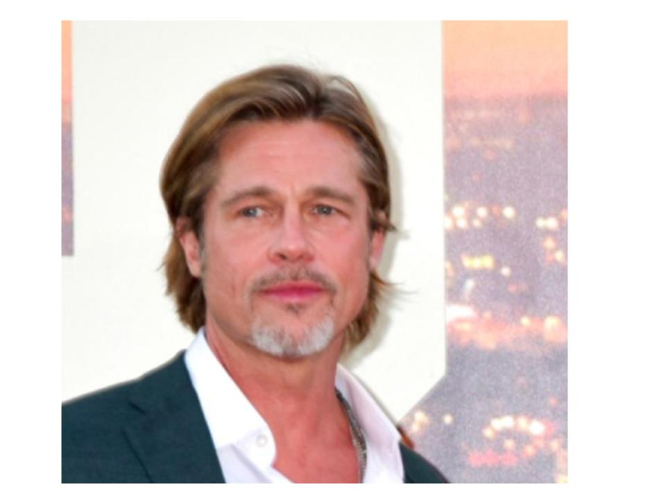
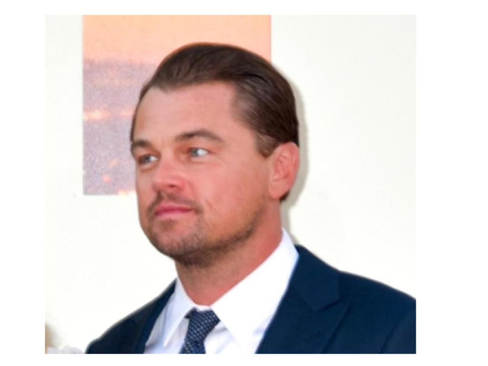
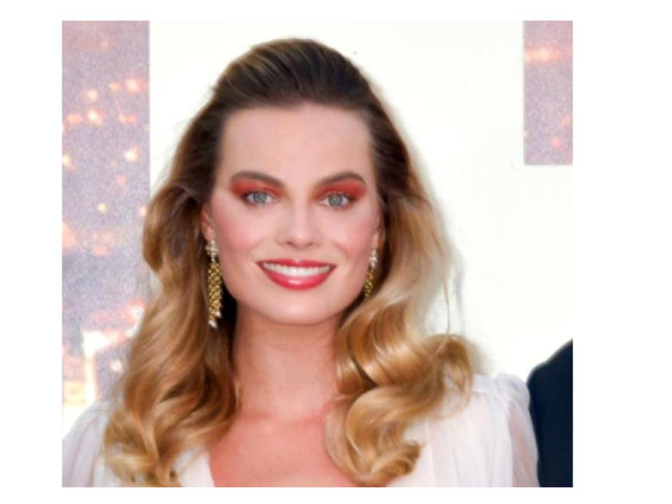

# Dog Breed Prediction 

Have you ever thought about what kind of dog you would be? Well now you can know! Simply follow the instructions below. 

This repository focuses on predicting the breed of a dog (or the potential breed of a human) from pictures of dogs (or humans) using TensorFlow neural networks. We explored various neural network architectures, deploying the best-performing model with a Flask-based inference server. This README covers the deployment and usage of the model inference server.

This model can predict 120 different dog breeds, as feature in the [Stanford dogs dataset](http://vision.stanford.edu/aditya86/ImageNetDogs/).

Note that in the `models/` directory, the VGG16 model is not there because it exceeded GitHub's 100 Mb file size limit. This file is in the docker image.


## Example Output

For this picture (of myself), my model said I was a miniature poodle:
```
$ curl -X POST -F 'image=@./assets/jt-2-34.JPG' http://localhost:5000/model/predict
{
  "result": "miniature poodle"
}
```
 

For some celebrities we have the following:

```
$ curl -X POST -F 'image=@./assets/bradPitt.jpg' http://localhost:5000/model/predict
{
  "result": "Brittany spaniel"
}
```

 


```
$ curl -X POST -F 'image=@./assets/leoDicaprio.jpg' http://localhost:5000/model/predict
{
  "result": "Gordon setter"
}
```

 


And lastly, one that I think the model got wrong:

```
$ curl -X POST -F 'image=@./assets/margotRobbie.jpg' http://localhost:5000/model/predict
{
  "result": "bull mastiff"
}
```

 

# TensorFlow Model Serving API

## Overview

This API serves as an interface for predicting dog breeds from a given image using pre-trained TensorFlow models. It allows users to predict a dogs breed, change the underlying model, and retrieve information about the current model.

## Use

### API Endpoints

| Endpoint            | Method | Description                                                                                         |
|---------------------|--------|-----------------------------------------------------------------------------------------------------|
| `/model/info`       | GET    | Provides basic information about the currently loaded TensorFlow model, including its parameters.   |
| `/model/models`     | GET    | Lists the available TensorFlow models that users can switch to, indicating the default model.      |
| `/model/predict`    | POST   | Predicts a dog's breed, given a jpg picture of the dog.                                            |
| `/model/change`     | POST   | Changes the TensorFlow model used by the server to a specified model.                              |
| `/model/summary`    | GET    | Provides a textual summary of the currently loaded TensorFlow model's architecture.                |
| `/help`             | GET    | Provides an overview and usage examples for the available API endpoints.                           |

*Note: prediction through the input server only supports 1 image per request*


### Running with Docker (Recommended)

The official Docker image for this inference server is `jthet/dog-breed-prediction:latest`.
This method is recommended because the docker image contains all the models while this repo (and using docker-compose) only contains lenet5 and InceptionV3. Therefore, `docker compose` does not support use of the VGG16 model through the inference server.

Run:
```
$ docker pull jthet/dog-breed-prediction:latest
$ docker run -p 5000:5000 jthet/dog-breed-prediction:latest
```

This will then start up a flask server to which cURL requests can be made. See "Making Requests to the Inference Server"

### Running with Docker-compose
First pull this repository. Note that only the lenet5 and InceptionV3 models are available if not using the docker image. `docker compose` does not support use of the VGG16 model through the inference server.
#### Starting the Inference Server with Docker-compose

To start the inference server with Docker Compose, follow these steps:

1. Open a terminal or command prompt.
2. Navigate to the directory containing the `docker-compose.yml` file.
3. Run the following command:

   ```bash
   docker-compose up
   ```
This command builds the Docker image (if it hasn't been built) or rebuilds it if the Dockerfile has changed since the last build. Then, it starts the container defined in the docker-compose.yml file.

The server will start, and you can access it at http://localhost:5000 (http://127.0.0.1:5000). If port 5000 is in use locally, change `ports:` to 5001:5000 and just use port 5001.

#### Stopping the Inference Server

To stop the inference server and remove the containers, use the following command in the same directory as your docker-compose.yml file:

```
docker-compose down
```

### Making Requests to the Inference Server

#### Requesting Model Information
To retrieve information about the currently loaded model, you can make a GET request to the /model/info endpoint:

```
$ curl http://localhost:5000/model/info
{
  "description": "Predict the breed of a dog using the inception tensorflow model.",
  "name": "inception",
  "non-trainable parameters:": "21802784",
  "total parameters:": "22048664",
  "trainable parameters:": "245880",
  "version": "v1"
}
```
This request will return JSON data containing details such as the model's version, name, description, and parameter counts.

#### Predicting a Dog's Breed
To classify an image using the inference server, send a POST request to the /model/predict endpoint with the image you want to classify. Here's an example using curl:

```
curl -X POST -F "image=@path/to/your/image.jpg" http://localhost:5000/model/predict
```
for example:
```
$ curl -X POST -F 'image=@./data/images/pug-1.jpg' http://localhost:5000/model/predict
{
  "result": "pug"
}
```

#### Changing the Model
If the server supports changing the inference model, you can do so by sending a POST request to the /model/change endpoint with the name of the model you wish to use:
```
curl -X POST -H "Content-Type: application/json" -d '{"model_name": "new_model_name"}' http://localhost:5000/model/change
```
for example:
```
$ curl -X POST -H 'Content-Type: application/json' -d '{"model_name": "inception"}' http://127.0.0.1:5000/model/change

{
  "message": "Model changed to inception successfully",
  "model_path": "models/inception.keras"
}
```
Similar curl calls can also be done for all the other API endpoints. Inception is the default model.

**See the file `inference_example.ipynb` for examples of use for each API endpoint in depth**

## Model Training
### Data:
The data that was used for this project can be found in the `/data` directory of this repository. It contains the Stanford dogs data set: a dataset of pictures of dogs of different breeds. The pictures are all JPEG format and of various sizes. Each image is labeled with the breed of the dog in the picture. The RGB values were normalized to the range [0, 1] for model training. After that, the data was split for testing and training and several different neural network architectures were used.

### Architectures:

We experimented with several neural network architectures, including:

- **Inception V3**: A convolutional neural network based on the InceptionV3 architecture, adjusted for our image dimensions.
```
Model: "sequential_3"
_________________________________________________________________
 Layer (type)                Output Shape              Param #   
=================================================================
 resizing (Resizing)         (None, 299, 299, 3)       0         
                                                                 
 inception_v3 (Functional)   (None, 2048)              21802784  
                                                                 
 dropout (Dropout)           (None, 2048)              0         
                                                                 
 dense_11 (Dense)            (None, 120)               245880    
                                                                 
=================================================================
Total params: 22048664 (84.11 MB)
Trainable params: 245880 (960.47 KB)
Non-trainable params: 21802784 (83.17 MB)
_________________________________________________________________
```

- **LeNet-5 CNN**: A convolutional neural network based on the classical Lenet-5 architecture, adjusted for our image dimensions.

```
Model: "sequential_2"
_________________________________________________________________
 Layer (type)                Output Shape              Param #   
=================================================================
 conv2d_2 (Conv2D)           (None, 124, 124, 6)       456       
                                                                 
 average_pooling2d_2 (Avera  (None, 62, 62, 6)         0         
 gePooling2D)                                                    
                                                                 
 conv2d_3 (Conv2D)           (None, 58, 58, 16)        2416      
                                                                 
 average_pooling2d_3 (Avera  (None, 29, 29, 16)        0         
 gePooling2D)                                                    
                                                                 
 flatten_2 (Flatten)         (None, 13456)             0         
                                                                 
 dense_8 (Dense)             (None, 120)               1614840   
                                                                 
 dense_9 (Dense)             (None, 84)                10164     
                                                                 
 dense_10 (Dense)            (None, 120)               10200     
                                                                 
=================================================================
Total params: 1638076 (6.25 MB)
Trainable params: 1638076 (6.25 MB)
Non-trainable params: 0 (0.00 Byte)
_________________________________________________________________
```

- **VGG**: A custon model with the VGG-16 architecture as described by [this paper](https://arxiv.org/pdf/1409.1556.pdf)
```
Model: "vgg16"
_________________________________________________________________
 Layer (type)                Output Shape              Param #   
=================================================================
 input_3 (InputLayer)        [(None, 128, 128, 3)]     0         
                                                                 
 block1_conv1 (Conv2D)       (None, 128, 128, 64)      1792      
                                                                 
 block1_conv2 (Conv2D)       (None, 128, 128, 64)      36928     
                                                                 
 block1_pool (MaxPooling2D)  (None, 64, 64, 64)        0         
                                                                 
 block2_conv1 (Conv2D)       (None, 64, 64, 128)       73856     
                                                                 
 block2_conv2 (Conv2D)       (None, 64, 64, 128)       147584    
                                                                 
 block2_pool (MaxPooling2D)  (None, 32, 32, 128)       0         
                                                                 
 block3_conv1 (Conv2D)       (None, 32, 32, 256)       295168    
                                                                 
 block3_conv2 (Conv2D)       (None, 32, 32, 256)       590080    
                                                                 
 block3_conv3 (Conv2D)       (None, 32, 32, 256)       590080    
                                                                 
 block3_pool (MaxPooling2D)  (None, 16, 16, 256)       0         
                                                                 
 block4_conv1 (Conv2D)       (None, 16, 16, 512)       1180160   
                                                                 
 block4_conv2 (Conv2D)       (None, 16, 16, 512)       2359808   
                                                                 
 block4_conv3 (Conv2D)       (None, 16, 16, 512)       2359808   
                                                                 
 block4_pool (MaxPooling2D)  (None, 8, 8, 512)         0         
                                                                 
 block5_conv1 (Conv2D)       (None, 8, 8, 512)         2359808   
                                                                 
 block5_conv2 (Conv2D)       (None, 8, 8, 512)         2359808   
                                                                 
 block5_conv3 (Conv2D)       (None, 8, 8, 512)         2359808   
                                                                 
 block5_pool (MaxPooling2D)  (None, 4, 4, 512)         0         
                                                                 
=================================================================
Total params: 14714688 (56.13 MB)
Trainable params: 14714688 (56.13 MB)
Non-trainable params: 0 (0.00 Byte)
_________________________________________________________________
Model: "sequential_4"
_________________________________________________________________
 Layer (type)                Output Shape              Param #   
=================================================================
 vgg16 (Functional)          (None, 4, 4, 512)         14714688  
                                                                 
 flatten_3 (Flatten)         (None, 8192)              0         
                                                                 
 dropout_1 (Dropout)         (None, 8192)              0         
                                                                 
 dense_12 (Dense)            (None, 2048)              16779264  
                                                                 
 batch_normalization_94 (Ba  (None, 2048)              8192      
 tchNormalization)                                               
                                                                 
 dropout_2 (Dropout)         (None, 2048)              0         
                                                                 
 dense_13 (Dense)            (None, 2048)              4196352   
                                                                 
 batch_normalization_95 (Ba  (None, 2048)              8192      
 tchNormalization)                                               
                                                                 
 dropout_3 (Dropout)         (None, 2048)              0         
                                                                 
 dense_14 (Dense)            (None, 120)               245880    
                                                                 
=================================================================
Total params: 35952568 (137.15 MB)
Trainable params: 21229688 (80.98 MB)
Non-trainable params: 14722880 (56.16 MB)
_________________________________________________________________
```


### Evaluation and Model Selection
Models were evaluated based on their accuracy score on the validation set. 

The `inception` model, of the InceptionV3 architecture using the pretrained ImageNet weights, was found to be the best model.
